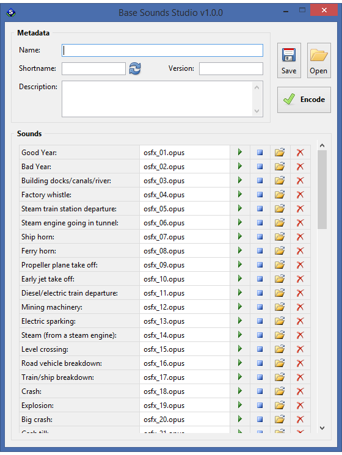

# Base Sounds Studio

**Base Sounds Studio** is a Lua-based GUI application that creates **base-sounds sets** for OpenTTD.



It provides a user-friendly interface for managing sound effects while supporting a wide range of audio formats. It is designed for users with little or no experience in coding or mod development.


## Features

- **No coding required** — generate functional base-sounds sets through a practical graphical interface
- **Portable and easy to use** — lightweight Windows release, no installation needed, compiler included
- **Save and resume anytime** — store projects in progress and reopen them whenever you're ready to continue
- **Ready-to-use output** — produces a `*.tar` archive that can be used directly in the game
- **Supported input formats**:

```pre
.mp3, .ogg (Vorbis, Opus), .opus, .m4a/.mp4 (AAC, ALAC, MPEG),
.mka/.mkv (AAC, ALAC, MPEG, Vorbis), .avi (AAC, MPEG), .aac,
.mpc, .flac, .ape, .wv, .wav.
```


## Installation

Download the latest **portable Windows release** from the [Releases](https://github.com/chujo-chujo/Base-Sounds-Studio/releases) page.<br>
It includes all required dependencies precompiled (Lua, IUP, etc.), so no additional setup is needed. 

After extracting `Base-Sounds-Studio-winx64-portable.zip`, start the application by running `START.bat`.


## Dependencies

This script uses the [IUP Portable User Interface](https://www.tecgraf.puc-rio.br/iup/) (`iuplua`), licensed under the terms of the MIT license.<br>
For full copyright notice, go to [Tecgraf Library License](https://www.tecgraf.puc-rio.br/iup/en/copyright.html).

The Microsoft Component Object Model (COM) binding for Lua [LuaCom](https://github.com/davidm/luacom) is used to run external binaries via CLI commands (MIT license).

For directory manipulation, the app uses [LuaFileSystem](https://github.com/lunarmodules/luafilesystem) (MIT license).

Sound playback and audio format conversion are provided by [fmedia](https://github.com/stsaz/phiola) (BSD 2-Clause license).

The compiler [catcodec](https://github.com/OpenTTD/catcodec) encodes samples into CAT files (GPL-2.0 license).

[7za](https://www.7-zip.org/download.html), a standalone command-line version of the 7-Zip file archiver, is used to pack results into TAR archives (LGPL v2.1 license).

The default set of sound effects is [OpenSFX](https://github.com/OpenTTD/OpenSFX) (distributed under the CC BY-SA 3.0, GPLv2 and CDDL 1.1 licenses).


## Usage

For detailed instructions, screenshots, and examples, please refer to the full manual:

👉 [User Manual for Base Sounds Studio](https://chujo-chujo.github.io/Base-Sounds-Studio/)

### Known issues

Several functions of this application rely on external binaries executed via CLI commands using `WScript.Shell`.<br>
Windows Defender or other security software may protest or incorrectly mark these files as malicious.  

All sources of these binaries are listed in [Dependencies](#dependencies), and I consider them trustworthy.  
If you have any doubts, feel free to review them and make your own judgement.


## Contact

For feedback or questions about the app, you can reach me<br>
**@chujo** on OpenTTD's Discord ([discord.gg/openttd](https://discord.gg/openttd))

For general questions about mod development,<br>
feel free to ask in the **`# add-on-development`** channel.


## License

This project is licensed under [CC BY-NC-SA 4.0](https://creativecommons.org/licenses/by-nc-sa/4.0/).
See the [LICENSE](./LICENSE) file for details.
